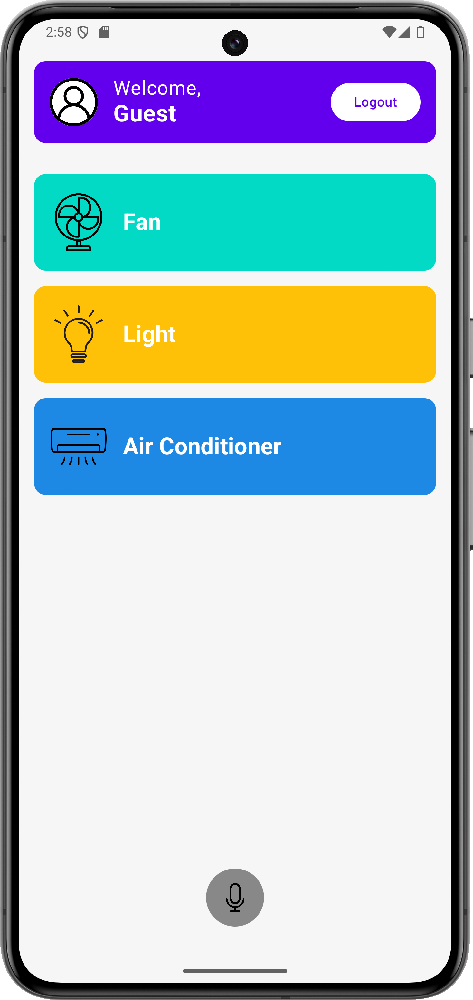
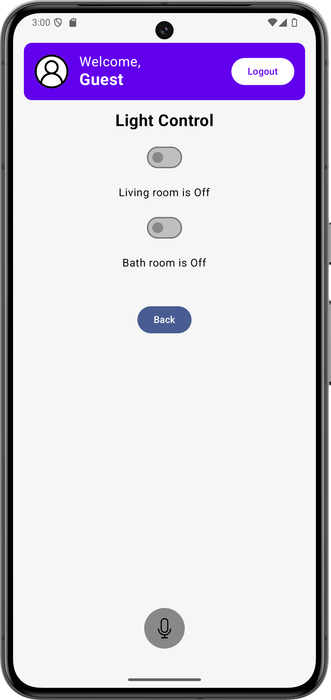
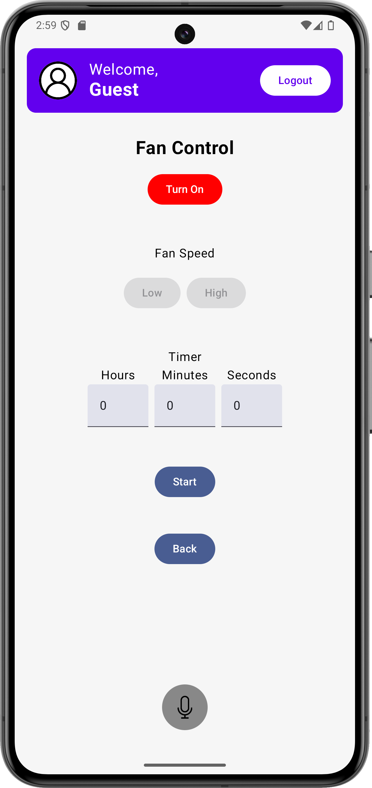
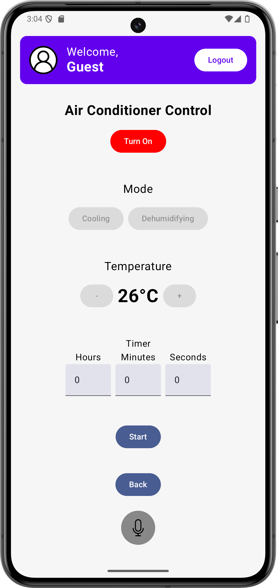

# Development-of-a-Voice-Enabled-Smart-Home-Control-System
>🎓 This project was completed as my undergraduate thesis and was one of the key works submitted for my successful admission to a master’s program in South Korea. 

>🚫  Unauthorized copying or reproduction is strictly prohibited. This repository is for reference only.
# Project Overview

This project is my **graduation thesis**, aimed at developing a **voice-interactive smart home appliance control system**. The system simulates the control of home appliances such as fans, lights, and air conditioners through **voice commands**. It supports **real-time voice recognition** and control, and can be **remotely managed** via a mobile application.


## Key Features

- **Control of home appliances**: Manage fans, lights, and air conditioners using voice commands or manual controls.
- **Light Control**: Control lights in different rooms individually.  
- **Fan Control**: Three-speed adjustment, timer control.  
- **Air Conditioner Control**: Mode switching, temperature & airflow adjustment, real-time display.  
- **Login & Security**: Supports face recognition login.  


## Basic Workflow

1. Users **log in** (can use face recognition for login).
2. Use **voice commands** (e.g., "Turn on the fan") or **press buttons** to control the appliances.
3. Users can **set timers** to schedule when appliances should turn on or off and monitor their status.

## My Responsibilities

In this project, I was responsible for the following areas:

- **Mobile app interface design**: I designed and developed the mobile app interface for controlling appliances such as fans, lights, and air conditioners.
  
- **User authentication**:  I implemented the user login functionality, ensuring that users can securely access the app.
  
- **Facial recognition**: I used OpenCV to capture the camera feed and integrated a pre-trained model to recognize and authenticate users based on facial features, enhancing the system's security and ensuring a seamless login experience.
> (Note: Hardware integration and control with devices like the Raspberry Pi were not part of my contributions.)

## Face Recognition Versions

This project includes **two versions** of the face recognition module, designed for different usage scenarios:

- `opencv_realtime.py`  
  → A **production-oriented version**, used by the backend server.  
  It supports **face login through the app** and integrates with Flask and database logic for user authentication.

- `opencv_realtime_full_version.py`  
  → A **real-time webcam-based** face recognition script, primarily used during development for **testing and model training**.  
  It helps verify that the system correctly captures and recognizes a face before integration into the app.

In addition, the full version (`opencv_realtime_full_version.py`) supports **adding new faces** to the dataset.  
Users can input a name and capture a series of face images, which are then saved and used to retrain the recognition model.  
This allows the system to **dynamically expand the list of recognizable users**, improving real-world usability and flexibility.

Both versions use the same deep learning-based face embedding model (OpenFace), but are adapted to different stages of the system workflow.

## Tech Stack

| Layer        | Tech Used                     |
|--------------|-------------------------------|
| 📱 Frontend  | Android (Kotlin)                |
| 🧠 Backend   | Python + Flask                |
| 🧬 AI/ML     | OpenCV + DNN Face Recognizer  |
| 🗄️ Database  | MySQL                         |
| 🌐 Realtime  | Flask-SocketIO, Flask-CORS    |
| 🔐 Config    | Python-dotenv (.env)          |

## ⚙️ Environment Variables

Please create a `.env` file in the root directory and fill in your own MySQL credentials:

```env
MYSQL_USER=your_mysql_user
MYSQL_PASSWORD=your_mysql_password
MYSQL_DB=your_database_name
MYSQL_HOST=localhost
```

## Demo Screenshots
<div style="display: flex; justify-content: center;">
  
  
  
  
</div>

## Demonstration Video
**Watch the full demo**: [Click here](https://youtu.be/QZ_JLb-7iHs)

